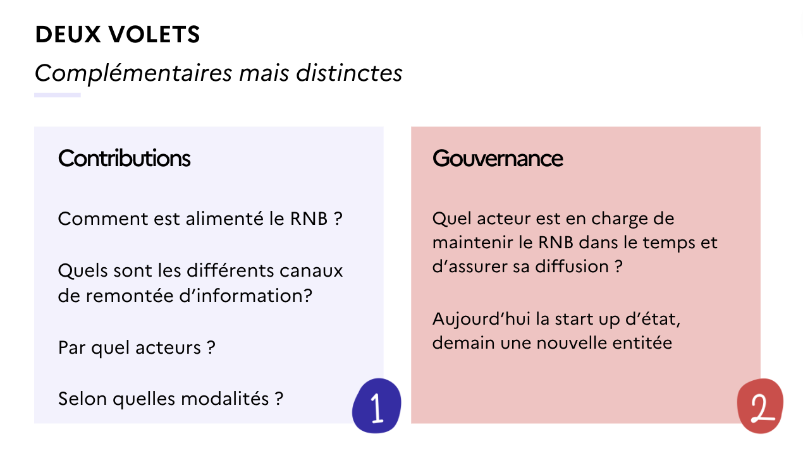
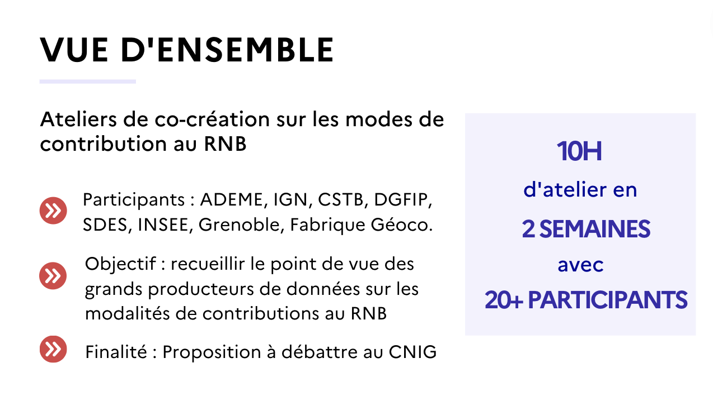
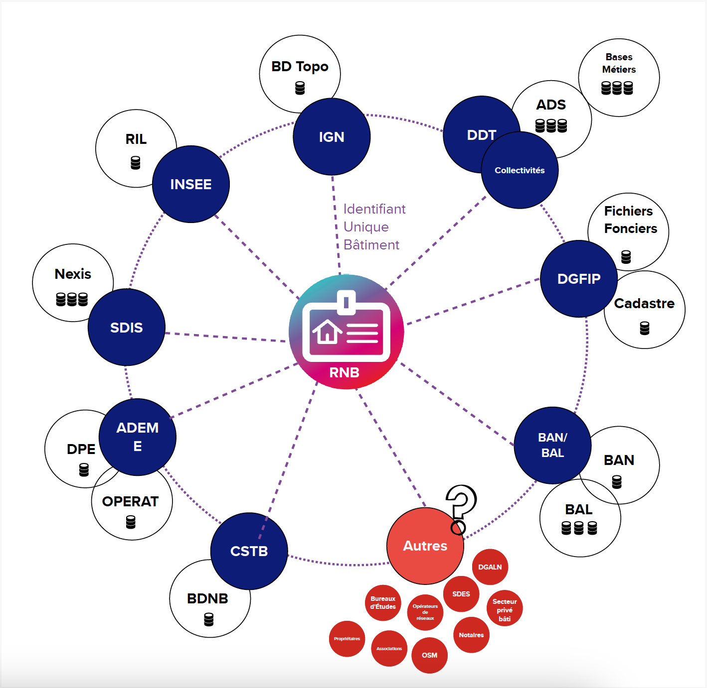
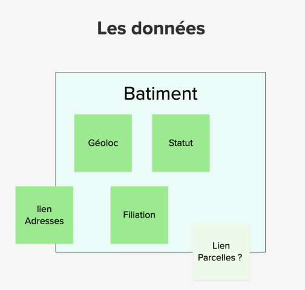
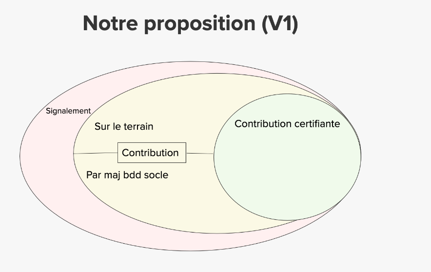
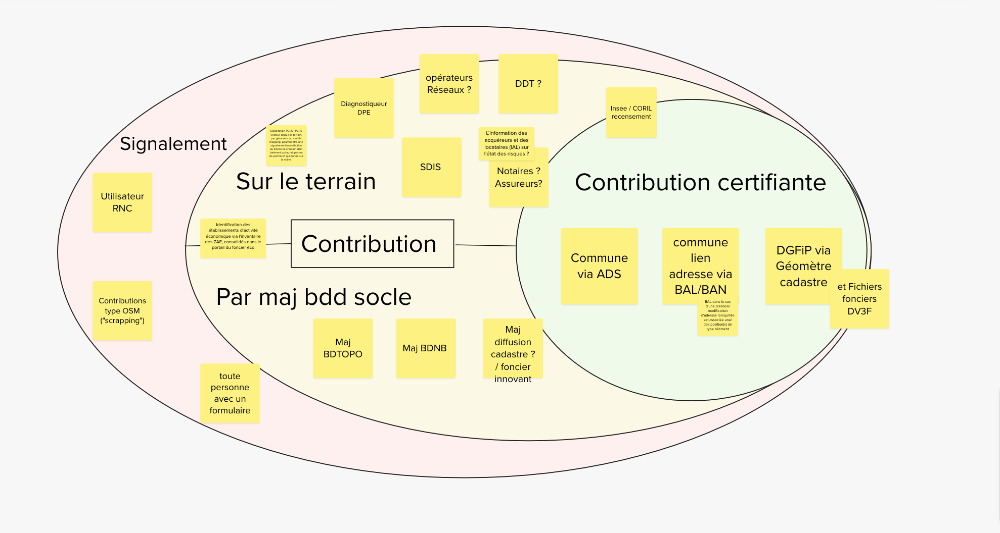

# GT Bati CNIG 11 - 06-10-2023

**Date:** 06.10.2023

- [Lien vers prise de notes collaboratives via HedgeDoc](https://demo.hedgedoc.org/IkheteFLTFmiDeltANRitQ?view)
- [Lien vers le support Mural pdf](CR-GT-11-support-Mural.pdf) et [la version Mural en ligne](https://app.mural.co/t/batid0128/m/batid0128/1694501566798/81ce9afcdb7151d90115217b997ae875e46b0f84?fromVisitorModal=true&sender=0d87ee79-45a2-4aa4-a5c0-e749196dbff4)

**Participants:**

- Maël REBOUX (AITF)
- Arnauld GALLAIS (Cerema)
- Régis Haubourg (CSTB)
- Loïc REBOURS (Enedis)
- Vincent Masson (IGN)
- Olivier Lefebvre (Insee)
- Audrey Houssais (RNB Bat-ID)
- Félix V (RNB Bat-ID)
- Chloé Bertrand
- guignabaudet colin
- Julieta Barado - DGALN
- Bernard FRANC/Veronique FAYARD Bureau GF-3A DGFiP
- Adeline Ferchaud - Bordeaux Métropole
- Gaetan Danet (Rennes Métropole)
- Pierre PAGES (Toulouse Métropole)
- Benoit David - MTECT/Ecolab
- Simon Guilloton (Géovendée : Prj jumeau numérique)
- Cecile Gatineau - La Poste
- Mael REBOUX - Rennes
- Sébastien Wehrlé (Eurométropole de Strasbourg)
- Elisabeth Talbourdet-ville (RNB Bat-ID)
- Rémi Beaurain (chef projet data à Géo Vendée)

## Actualités sur le RNB

- La DGALN rejoint les 3 porteurs du projet => facilite les avancées réglementaires autour de l'ADS
- Arrivée d'une chargée de relations institutionnelles + un nouveau développeur

Le site web [rnb.beta.gouv](https://rnb.beta.gouv.fr/) est lancé (en mode MVP : Produit Minimum Viable)

Priorité du moment sur la mise en place de services de rapprochement de données existantes à l'échelle bati. L'équipe est à la recherche de communes "test" s'il y a des participants potentiels dans le groupe de travail.

Contact possible à rnb.beta.gouv.fr ou rnb@beta.gouv.fr.

## Modes de contributions au référentiel

Aujourd'hui focus sur le volet contribution, les questions que l'on se pose:
- Qui fait quoi dans le référentiel, comment on l'alimente et le met à jour de manière fiable et régulière.
- Précision : Volet bien distinct de la gouvernance qui suppose la question sous-jacente évacuée aujourd'hui mais qui sera traitée plus tard : qui est responsable (ou co-responsable ?) du référentiel ?
- Par ailleurs, les modes de résolution de conflit seront également abordés lors d'un prochain atelier
- 

Contexte méthodologie :

Vue d'ensemble des acteurs pressentis :

Vue d'ensemble des attributs modifiables par ces acteurs (qui ne représentent pas l'intégralité des données du MDD) :

## Proposition de modes de contribution

Explications :
- Contributions certifiantes : un flux administratif jugé comme qualifié permet de faire une modification sur une ou plusieurs informations du RNB de manière certifiée. Ce sont des flux qui concernent directement un bâtiment et non juste un flux qui est "relié" aux objets bâtiments (par ex. le flux PCRS qui ne relève pas que des bâtiments)
- Contribution sur le terrain : une personne se déplace, dans le cadre de ses fonctions, et constate une ou plusieurs modification sur le terrain. Ils peuvent contribuer de manière non-certifié, mais amener leur regard terrain. Il sera nécessaire de tracer les modifications pour pouvoir suivre qui fait quelles modifications.
- Contributions par les MAJ de Bases de Données Socles : Envisager comment certaines MAJ des bases de données concernant les bâtiments (ex. la BD Topo) fassent évoluer le RNB.
- Signalement : Un certain niveau d'information, on ne sait pas si l'information est qualifiée ou autre, et cette information permet d'informer d'une évolution ou d'une erreur dans le RNB.

## Questions générales :
- Contribution certifiante : Une commune créé une nouvelle adresse, est ce qu'on part du principe que c'est parce qu'il y a un bâtiment sur une parcelle foncière ?
    - Oui, s'il y a une opportunité (on sait que ce n'est pas une obligation légale).
    - Mais c'est bien si on détecte une nouvelle adresse avec une position type bâtiment, on le prend pour argent comptant comme contribution certifiante
- Où est ce qu'on place les BD PCRS dans ce schéma ?
    - Logiquement c'est comme une BD socle maintenue à jour par les collectivités. Ça peut être soit du socle, soit du terrain (relevé par des géomètre). Donc plutot une CONTRIBUTION non certifiée. Mais comme c'est que du pdv des corps de rue, on a pas forcément tous les bâtiments.
    - On part du principe où il y a un linéaire qui part du bout du bâtiment topo et quelqu'un comme le CSTB pourrait croiser et voir que le bâtiment n'est pas sur le RNB et voir qu'il manque un bâtiment dans le RNB par rapport au PCRS.
    - Pas certifiant comme une BAL, avec de l'aléa mais ça peut être une remontée terrain assez intéressante.

## Échanges entre participants suite à l'exercice de reverse Brainstorming
- **Retours DGFIP** :
    - Difficulté potentielle dans la mise en oeuvre du flux issu de la DGFiP :
        - Dans le RIAL, un des agents créé un nouveau local, il faut que le référentiel créé tout de suite un ID pour qu'il circule dans les BDD. Il va donc falloir initialiser tous les locaux avec l'ID du batiment.
        - Quand on a un contribuable qui nous déclare un local et qu'on a pas de bâtiment, il va falloir récupérer l'ID bâtiment et avoir la possibilité d'en créer un.
        - Pas une énorme difficulté mais du temps technique
    - Remarque sur la différence entre la contribution certifiante qui provient du géomètre et le foncier innovant :
        - le FI c'est un module, il y a tout ce qui est reçu autour de la surveillance de la construction des locaux. Dans le FI un opérateur vérifie que c'est bon et s'il y a une conséquence fiscale, immédiatement il y a une demande de déclaration.
        - Typiquement ce qui est relatif à du certifiant : déclaration fiscale + géomètre. On sait qu'il y a une vérification terrain. Le FI est lui plutot un canal d'indice et il y a moins de ressource pour vérifier l'information.

- **Retours CSTB** :
    - Côté CSTB, on est en bout de chaine. Par nos application on a un flux constant de remontée d'anomalie (ex. adresse est fausse, vous avez identifié les mauvaises bâtiments, DPE...). Parfois aussi des informations qui pourraient intéresser la DGFIP (surface a changé, système de chauffage a changé).
    - On a besoin d'un débouché pour remonter de l'information bâtiment et que les fournisseurs d'information puissent les obtenir. Est ce qu'on pourrait voir ce qui est faisable comme création de hub de retour d'information ? Par ex via les outils de l'IGN ?
        - Dans signalement : formulaire de remontée d'anomalie, plutot pour les informations socles du RNB (pas nécessairement les informations métiers). La question ensuite c'est qui traite le signalement ?
        - Est ce qu'il faut des ressources pour passer des capacités de "signalement" vers une "contribution" ou/et d'une "contribution" vers une "contribution certifiante" ?
        - Quid si on a plusieurs signalements relatif à la même donnée : est ce que ça nous donne un faisceau d'indice suffisant pour faire une contribution ? Est ce qu'on va vraiment avoir le cas de plusieurs remontées pour la même erreur ?
- Idée du CSTB : on pourrait avoir un **indicateur de priorité de traitement de la modification.** Pas la même chose sur un signalement individuel, un agent de la commune (identifié via agent connect) est ce qu'on peut le faire remonter plus vite ?
    - Problème partagé avec l'ensemble des systèmes d'information de l'état, avec un hub de remontée d'information et d'anomalie. Difficile pour le RNB seul et par ex la BAN seule de faire les remontées ensemble ?

    - Même si ça marche, il reste que c'est un mille feuille de producteurs et de réutilisateurs. Dans tous les cas il y a des zones où il n'y aura pas de ressources disponibles.
    - Donc la question c'est est ce que l'approche OSM qui avec une complexité organisationnelle accepte les remontées d'informations de n'importe qui, avec une volonté ensuite de mettre des indices de confiance.
        - De prime abord, on aurait même pas le volet "contribution" vs. "signalement" mais maximiser la possibilité de contribution direct. OSM : possibilité de modifier un objet, et traité ensuite automatiquement, avec aussi parfois des modérateurs humains. Et parfois on demande à la communauté de donner un avis et trancher. Nos processus administratifs sont complexes, et donc ça fait un effet filtre avant qu'il y ai une chance de signalement qui arrive au bout. Un enjeu de temps et de compétence et de ressources.
    - Il est porté à la connaissance des  participants l'existence de https://moncomptepro.beta.gouv.fr/ qui pourrait peut-être être le chainon manquant dans l'authentification. AgentConnect est en effet réservé aux agents de l'Etat exclusivement.

- **Côté DGFIP réaction** : on voit qu'on a des remontées d'usagers sur le plan cadastral et c'est compliqué d'avoir les ressources pour les traiter. Donc intéressant l'idée de prendre toutes les remarques, et ensuite d'essayer de les qualifier en regardant par l'identification. Il faut essayer de trouver une méthode pour identifier les gens, et si on sait que ça provient d'un type d'utilisateur on accepte la contribution de facto. Sinon ça va être très compliqué à traiter au démarrage.
    - Enjeu : accepter beaucoup de contribution, mais voir l'identification du contributeur. Pour voir si un type d'acteur a bcp amélioré le RNB, et on le passe en contribution certifiante. Et à l'inverse d'identifier ceux qui dégradent
        - Solutions : Agentsconnect pourrait permettre d'identifier les contributions "certifié".
        - Mais attention, ce n'est QUE l'état et non les collectivités. A vérifier ! Regarder le registre des élus, mais difficile à maintenir à jour. Justement l'équipe BAN se sont déjà heurté à ces choses là. Au niveau de la certification des publications des BAL, ils doivent gérer une liste d'adresse mail que eux certifient. Le Géoportail de l'urbanisme est pareil (le droit de publier) est fait en fonction de l'utilisateur, Rennes Métropole doit être identifié l'adresse mail.
        - peut-être la sortie par le haut serait https://moncomptepro.beta.gouv.fr/

- **Remarques Rennes Métropole** :
    - Comment identifier un bâtiment démoli ? Rennes est hyper actif en terme de construction, on voit qu'au delà de savoir s'il y a des nouveaux bâtiments, voir ce qui a été démoli. Donc comment on le sait ?
        - Permis de démolir serait le meilleur flux ceux des Permis de Démolir (via ADS) mais pas forcément exhaustif. Donc possibilité de flux plus large ? Il faut vérifier et valider s'il y a bien toujours un permis de démolir
    - Mais risque dans le cas de renouvellement urbain : deux petites maisons détruites pour un construction d'un immeuble collectif. Est ce que c'est un seul permis de démolir ? ou deux ? Dans tous les cas c'est un signal d'activité sur la zone qui est intéressant

    - Proposition autre : Faire passer une recherche auto des bâtiments systématiquement sur toute nouvelle orthophotographie disponible. On voit que telle ortho existe, on fait passer le traitement IA dessus et ça identifie des points, on fait le tri
        - Un peu pareil que le Foncier Innovant ?
            - **Réponse côté DGFiP** : oui on est en phase d'expérimentation là dessus, et on veut partir en production au T1 2024 de détecter un bâtiment et de le reporter au plan (pas juste de demander une déclaration). L'orthophoto étant mis à jour tous les 3 ans, tous les ans on passera 1/3 des départements. Objectif suivant : utiliser les orthophoto pour une détection 5 cm (mais mise en prod plus tardive)
    - Quid des autres orthophoto au delà de la DGFIP ? Est ce qu'on peut appliquer la même chose à l'IGN par exemple ?
        - Attention il n'y a quasiment plus d'ortho financé 100% IGN : c'est financement mixte collectivités locales / IGN.

- **Retours CEREMA** :
    - Travaille actuellement sur la standardisation des Sites Economiques dont les ZAE (Zones d'activité Economique). Les EPCIs sont chargés de dresser régulièrement l'inventaire de leur ZAE, ce qui permet de répertorier les établissements d'activité situés dans les ZAE. Ce sont des sources potentielles de données. Parallèlement le portail national du foncier économique va ouvrir fin 2023 donc cette information devrait être standardisée et disponible. On disposera à terme de tous les établissements d'activité situés dans les ZAE.

    - Quid d'intégrer les FF?
        - Les FF classiques qui sont produits et qu'on délivre, il y a une vraie difficulté car pertinent au niveau des locaux mais sur les bâtiments, la gestion n'est pas optimum. D'où l'intérêt pour le RNB.
            - Les FF retravaillés par le CEREMA. Précision. Ce n'améliore pas nécessairement la qualité, mais il peut y avoir un faisceau d'indices sur un bien qui aurait fait l'objet d'une mutation
        - Regarder urban simul

- **Retours ENEDIS** :
    - Lien adresse : plusieurs informations d'adressage derrière : existence d'entrée, lien BAN et éventuel complément d'adresse éventuelle. Les contributions ne seront pas les mêmes et il faudra les gérer.
    - Ne pas compter que sur les géométries de la BAN (initialiser ou fiabiliser/qualité) => prévoir suffisemment de gestion de positions propres au RNB à prévoir (emprise, entrée en optionnelle ?)
    -  Risque de vision différente des métier sur les jalons/étapes du cycle de vie + Et difficultés liées aux temps de propagation --> Problème de signalement ?
    -  Gestion des fusions/scissions à traiter avec attention (analogie au sujet des communes !) - Vigilance : si des gens font des remontées d'informations et que le bâtiment est entre temps divisé en deux.
    -   distinguer différencier aussi les signalements. Par exemple :  1) du terrain (individuel) 2) par confrontation avec des bases métieurs utilisant le référentiel (score positif pour un batiment si il est bcp utilisé/référencé). Il faudrait peut être une 4e bulle de confrontation avec les utilisateurs du RNB qu'il faudrait mettre en exergue à part.

    -   Travailler sur :
1) contrôle aux flux
2) synchro au référentiel BAN
3) signalements sur données RNB
4) travaux d'évaluation qualité transverse

    - il faut de la donnée la plus tracé. Ce n'est pas l'objet réel mais aussi la description. Il faut bien suivre l'identification.
        - A préciser : il faut considérer que chaque modification a été faite par qui, quand etc...

- **Autre commentaire** : Ne faudrait-il pas traiter à part les "signalements / contributions" liées à l'initialisation du RNB et aux écarts entre bases ?
    - oui car selon les territoires : on ne partira pas du même état / qualité (comme la BAN…)
    - oui dans les contributions : il faut bien différencier les erreurs remontées, plutot que les propositions de corrections en cas de conflit.
    - Problématique : a l'initialisation ça risque de faire un gros flux de la part des communes qui risque de noyer le reste du flux qui est lié à la vie du bâtiment ?
        - Côté RNB : on est assez ouvert à intialiser avec le flux de la base locale : il faut le faire vite mais en même temps on ne peut pas attendre toutes les bases bâties locales. Mais c'est sur que plus tôt on le fait, moins c'est difficile à gérer.
- *A traiter dans l'atelier sur les résolutions de conflits : comment on gère les ID d'origines vs les nouveaux flux d'information.*

- **Retours IGN** :

    - Quelle convergence au niveau des spécifications (les attributs du bâti) et il faut que ça soit clairement spécifié pour pas qu'il y ai de dérive. Ce n'est pas forcément simple (parfois des attributs portent le même nom mais ont des signification compltement différente)

    - Est ce que toute conribution doit être certifiée et si oui, quelle charge et quel délai ?
        - Même si on le voulait, ça serait très difficile. Mais à voir quelles ressources on peut dédier à un certain niveau de certification.

    - Il faut que le RNB joue le rôle de référentiel. Il est alimenté par une communauté et chacun vient y chercher les infos.
        - Actuellement pour la BD Topo, on utilise actuellement les bâtiments de la DGFIP mais il faudrait pouvoir passer par le RNB en identifiant les bâtiments remontés par la DGFIP avec notamment l'arrivée imminente du Foncier Innovant qui va nous donner un flux important.

**Sur la résolution des conflits** :
- Rennes Métropole va avoir une photogramétrie des bâtiments dont ils tirent une version 2D en faisant un annule/remplace. Sur les cas simple, ils vont récupérer les ID locaux. On va avoir notre procédure, mais si on a du Foncier Innovant qui arrive sur la même commune, quel serait le pourcentage de conflit ? Comment on gère ce conflit ? Qui fait quoi ?
    - Rennes pourrait être un territoire d'expérimentation - intéressant ! Voir en décembre janvier.

- Loic : Un exercice qui sera utile je pense : si les changement de statuts matérialise des versions de description d'un bâtiment : il faudra éviter de vouloir gérer dans le RNB des attributs qui peuvent évoluer dans la réalité pour un même version de description (sinon, on va s'y perdre en signalement correction de donnée et signalement changement de la réalité). Les statuts seront les grands jalons de version des bâtiments. Alors que le champs surface s'il est modifié puisse introduire une modification de statut. Ce serait peut être à travailler dans le modèle.

- **Autre commentaire** : L’information des acquéreurs et des locataires (IAL) sur l'état des risques ?
    - Piste à explorer côté Notaire

- **Retours Insee** :
    - On a beaucoup parlé de l'analyse des divergences entre les différentes contributions. Mais quid du problème quand les contribution ne recouvrent pas tous les mouvements qui se passent sur le terrain ? Ça peut arriver car pb de MAJ des bases, pb d'acteurs qui passent à côté, communes avec des moyens divers... Cela fera parti des choses à regarder, relève de l'animation de la communauté & gouvernance.

    - Quid du bâtiment informel ? (Non déclaré, sans permis etc...). Pas mal présent comme problématique. Qu'est ce qu'on fait avec cette question là ?
        - Couverture améliorée par l'ensemble des contributions / signalement ?
    - Quid du littoral atlantique où les gens achètent un terrain avec une construction légère : Pour la BAN ils scindent le fait d'attribuer une adresse à la parcelle foncière et aussi parfois l'enjeu de est ce qu'une adresse va légitimé une construction illégale ? Il ne faut pas qu'on produise un ID de bâtiment. Une sorte d'amalgame d'officialisation.
        - **Réponse DGFIP** : bémol car illégal et légal qu'on les impose. Et ça n'a pas de conséquence en terme d'urbanisme et on propulse qu'on a détecté un local. Par contre on signal si on peut savoir s'il y a une autorisation d'urbanisme ou pas.
        - **Réponse CSTB** : Le rôle d'un référentiel c'est d'identifier des bâtiments au sens du terrain, pas une volonté d'être une "voie réglementaire". S'il y a une construction qui correspond à la définition on est ok.

    - **Autre Point de vigilance** : Être articulé avec la BAN.
