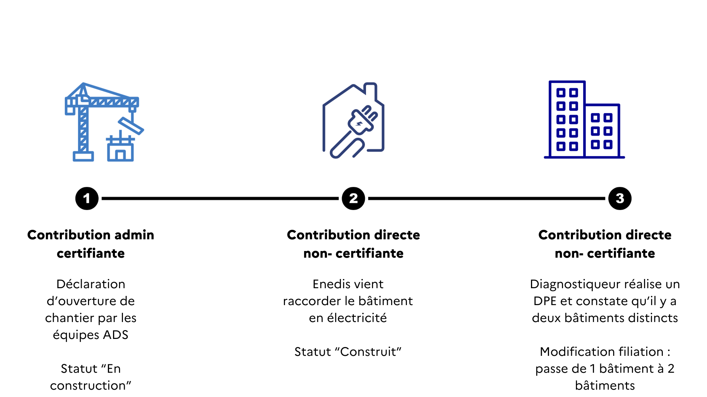
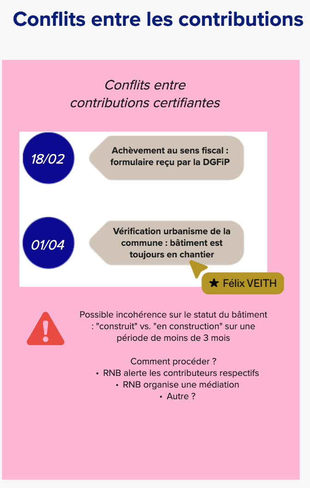
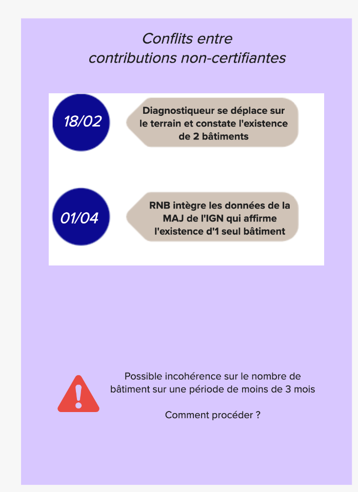

# GT Bati CNIG 12 - 15-11-2023

**Date:** 15.11.2023

- [Lien vers prise de notes collaboratives via HedgeDoc](https://demo.hedgedoc.org/PAYqQdR_TuqvPOHFKvvB2w?view)
- [Lien vers le support Mural pdf](CR-GT-12-support-Mural.pdf) et [la version Mural en ligne](https://app.mural.co/t/batid0128/m/batid0128/1694501566798/81ce9afcdb7151d90115217b997ae875e46b0f84?sender=3b72854b-a940-4bfa-9be3-0d674b42cffd)

**Participants:**

- Desvigne Virginie - Grenoble commune
- Elisabeth Talbourdet-ville - RNB
- Félix Veith - RNB
- Frédéric Chauvin - Rennes Métropole
- Guignabaudet - Montpellier Metropole
- Julieta Barado - DGALN
- Maël REBOUX - Rennes
- Maximilien Brossard - U.R.B.S)
- Nicolas ANDREANI - CPS Résil
- Sébastien Wehrlé - Eurométropole de Strasbourg
- Séverin Heyraud - Groupe La Poste
- Thierry Lallemant - IGN
- Véronique Fayard - DGFIP Bureau GF3A

# En résumé - Points clés

- Mettre en place un outil de médiation entre les différents contributeurs, avec un outil de discussion entre ces contributeurs pour les autonomiser dans la résolution de conflit
	- importance de gérer "proprement" la clotûre d'un conflit afin de garder un historique "sain".
- Réussir à bien identifier/authentifier les différents acteurs et être capables de les hiérarchiser : avec des qualificatifs de la source --> notamment en faisant remonter la visibilité des déplacements terrains
    - Pour évaluer le niveau de pertinence d'une contribution : la méthode de contribution (visite terrain ou orthophoto) / la source partenaire (identifié ou non, ex la métropole de Rennes pour les territoires de Rennes) / l'actualité de la source (date de la visite terrain ou la date de prise de vue aérienne et la date la plus récente est plus intéressante), et la possibilité d'apporter un commentaire texte justifiant une contribution.
- Ne pas lier le système de gestion & contribution avec le système de médiation. Important de quantifier les sigalements potentiels avant d'envisager une approche qui pourrait s'avérer complexe.

# À faire

- Consolider un document avec :
    - Rappel sur la définition
    - Le modèle de données
        - Champs et leurs définitions respectives
    - Le cycle de vie du bâtiment
    - Les différents modes de contributions
    - Les différents résolutions de conflits

# Rappel des propositions du précédent GT CNIG sur les modes de contributions

- Voir [CR GT n°11](https://github.com/fab-geocommuns/BatID/blob/main/CNIG/Comptes-Rendus/CR-GT-11.md)
- Différents types de contributions : Contributions certifiantes vs. contributions terrains vs. signalements
- La dernière session : on avait imaginé les différents types de contributions sur différents attributs : le statut du bâtiment, le lien adresse-bâtiment, les parcelles cadastrales, filiation
 
- Vues du RNB : Toutes ces contributions sont historisées
    - On peut choisir de consulter le RNB de différentes façons, par exemple soit avec l'ensemble des MAJ apportées par des contributions OU ne choisir de voir que le RNB mis à jour avec des contributions certifiantes
- Sur le Cycle de vie du bâti :
    - Les différentes étapes du cycle de vie du bâti sont reflétées au fil des contributions, faisant évoluer avec elles le statut du bâti notamment
    - Entre ces contributions, quelle date prendre en compte ? La date où l'information est reçue de faire évoluer le bâtiment et non la date de remontée de la modification dans le RNB
    - Exemple pour la prise en compte de date : intégration de donnée IGN publiée le 2 mars 2023, idéalement, les modifications devraient porter la date de relvé des infos de l'IGN (par exemple si les moficications proviennetn de prises de vue de juin 2022)

## Commentaires

- traditionnellement on met une date de création de la donnée - est ce que la mise en oeuvre serait compliqué de venir à la date de constatation ?
- Il serait intéressant de préciser la date de la constatation mais également la date de la contribution. C'est sûr que c'est plus compliqué d'avoir la date du constat (par ex. sur le RIL il y a un champs "date de détection" qui donne la date de l'évènement de la source et la "date de contribution" qui correspond à la remontée de l'information). C'est sur que l'on pourra avoir la date de contribution.
- Effectivement, l'usage est plutôt sur la date de création/modification de la donnée
- Pourrait on envisager de gérer une date d'effet (date de la constatation), une date de mise à jour (date de la contribution) et une source ?
- Se pose la question de à quel moment il y aura des variations entre ces deux dates ?
- Par expérience, lorsque l'on a plusieurs dates dans une table attributaire, il est rare qu'elles soient systématiquement renseignées. De plus, cela implique de la part de la personne qui va faire la saisie de renseigner le bon champ date... à moins qu'une application le fasse automatiquement à sa place.

# Conflits entre contributions

- Il y a par exemple une date de début et de fin de l'objet : nouveau bâtiment constaté par la dernière orthopho que l'on rentre, alors on a "dat.deb" qui correspond à la date de constatation par le biais de l'orthophoto. Par exemple, on mettrait 15 juillet 2021 pour la date de l'orthophoto, qui donnerait le début. Mais si la DGFiP a une information antérieure (ex. une déclaration qui date de décembre 2019) elle peut l'indiquer.
    - Différent de l'exemple ci-dessus où il y a un conflit direct.
- En cas de conflit : pourrait-on mettre en place une conciliation entre les deux contributeurs, et on pourrait connaitre la date des faits, la date du jour où la contribution où elle a été déposée, arriver à un consensus et invalider les précédentes dates et mettre de manière claire que la date du consensus est la date de dernière contribution.
- Plus riche d'expliquer pourquoi il y a eu un conflit, comment il s'est résolu et pourquoi on est arrivé au consensus. En tout cas a minima savoir qu'il y a eu résolution de conflit et quel en est le résultat.
- Il faudrait bien indiquer qu'il y a eu résolution, et surtout pouvoir être sûr qu'il n'y a qu'une seule contribution qui a été retenue au final. Il ne faudrait pas qu'il y ai des contributions qui peuvent être concurrentes. L'effet final serait d'archiver toutes les contributions précédentes pour s'assurer qu'il n'y ai pas de confusion.
- Il y a aussi différents types de contributions certifiantes : entre les contributions déclaratives du citoyens vs. l'agent de l'état ou de la collectivité qui a fait un constat. Y a-t-il un même poids à avoir entre l'un et l'autre ? Y a t il un besoin de hiérarchiser entre les types de sources pour avoir une échelle de fiabilité entre les informations, et en cas de conflit qui émerge on pourrait en résoudre automatiquement.
- Par exemple, de la même manière les déplacements terrains pourraient être considérés plus fiables que les orthopho aériennes.
- Sur les « remontées utilisateur » qu’on a coté IMOPE/ONB, on capte par défaut et automatiquement « date saisie de la donnée », et si pertinent, l’utilisateur peut renseigner manuellement « date début » ; « date fin » (par exemple pour des signalements), mais ce n’est effectivement pas toujours pertinent, ou comme le dit Frédéric, l’expérience montre que ces champs ne seront pas toujours renseignés par les utilisateurs

## Qu'est ce qu'un conflit ?

- Soit on les identifient tous, avec une liste des possibles conflits
- Soit à chaque distinction de vision : mais typiquement sur l'achèvement au sens fiscal et l'achèvement au sens de l'urbanisme ne sont pas les mêmes (dans la temporalité). Donc est ce que par exemple il faudrait des degrés d'achèvements ? Ou travailler sur des statuts supplémentaires ?
- Qu'est ce qui doit déclencher le changement de statut ? L'achèvement fiscal peut aussi ne PAS changer le statut mais être une simple information intéressante à avoir dans l'historique.
- Peut être que finalement il n'y a pas tant de "conflit" plus qu'une logique de succession d'information de différents contributeurs qui permettent de donner une vision complète de l'information sur la vie du bâtiment. Le simple changement de statut est moins gênant que le découpage et la création de bâtiments.

- En revanche, sur l'exemple n°2, sur le découpage des bâtiments, on constate qu'il peut plus souvent y avoir de réels conflits. Là où c'est plus problématiques en coupant/fusionnant des bâtiments, on va également casser des liens, ce qui va rendre les choses plus compliquée pour les réutilisateurs.
- Si on veut éviter l'émergence de conflit, il faudrait pouvoir commenter le "pourquoi" le contributeur réalise cette modification. Dans OSM, c'est obligatoire de mettre un commentaire en expliquant pourquoi on contribue (très libre). En option, il y a également une liste déroulante pour donner la source d'information. L'éditeur est intelligent et en fonction de la zone du globe, la liste déroulante évolue. Mais c'est compliqué de vouloir aller trop loin et de faire ces évolutions.
- Le champs texte est peut être moins compliqué a mettre en place.
- Les cas sont difficiles à identifier : Par ex ce qui est en cours de mise en place sur la BAN, on garde la contribution et on incrémente un historique sur l'objet modifié. La commune et la DGFIP contribuant directement, la plupart du temps on a des étapes qui vont aller progressivement dans le sens des contributeurs quand tout se passe bien (90% des cas?).
- La mise en place du flux en effet ne devrait pas poser de problème, car les évènement devraient s'enchainer chronologiquement
- Ce qui risque d'être compliqué c'est plutot le rattrapage du stock, notamment en habitat dense typiquement les centres villes c'est plus délicat.
    - Sur les pavillons : on a parfois 3 points d'ADS à cause des permis modificatifs.
    - Est ce que le stock compare déjà les données ADS et documents d'urbanisme pour identifier des incohérences ? ou pas encore ? Le stock ajd est créé par les enveloppes existantes de la BD Topo & BDNB mais est ce qu'on aurait pour but d'aller récupérer des données d'urbanisme pour aller géolocaliser les différences entre les données thématiques et les données géographiques : est ce qu'il y aurait une action de mise à niveau ? En se donnant quelques mois pour aller chercher tous les Permis de Construire des 3 dernières années ? Ou avec les fichiers DGFiP pour voir si on a intégré toutes les nouvelles déclarations ?
    - MAIS si on améliore la qualité du stock aujourd'hui, on aurait forcément moins de conflits dans les arrivées de flux.

## Méthode de résolution de conflits

- Mise en relation automatique + outils pour échanger entre contributeurs directement pour résoudre le conflit.
- S'il n'y a pas de résolution possible : Médiation avec sollicitation d'un acteur externe
- RORCAL : outil de l'INSEE pour la validation du RIL, quand il y a des conflits sur l'objet, il y a un chat où les personnes peuvent échanger pour expliquer en quoi ils ne sont pas d'accord sur les contributions.
- Sur OSM : toute modification se fait sur la base d'un change-set embarquant 1 ou des milliers de modifications attributaires ou géométriques et sur ce change set qu'il y a des commentaires et que l'on peut faire des attributions.

# Sur les signalements

- Qui gère la modération des signalements ?
- Est ce que certains contributeurs peuvent intégrer des signalements et les valider ?
- Selon quel périmètre ?
- Est il nécessaire d'avoir une équipe centralisée ?
- Quelles ressources allouer ?
- Comment prioriser / prendre en compte les signalements ?

Possibles solutions:

- Tous les contributeurs peuvent avoir accès aux signalements
- Chacun s'en empare sur son champs d'action pour éviter d'avoir plusieurs contributeurs sur le même signalement ?
- Les acteurs assez concertés par ça sont les communes mais ça dépendra aussi d'en quoi consiste le signalement : si ça concerne l'adresse c'est la commune qui est compétente mais si c'est d'autres choses peut être que le signalement pourrait être traité par quelqu'un d'autre ?
- Que se passe-t-il si pendant 2 ans aucun traitement n'est fait d'un signalement ?
- Si par exemple il y a 3 signalements d'acteurs différents sur le même objet, il est automatiquement pris en compte ?
- ATTENTION : à la responsabilité et la charge que cela prend.
- ATTENTION AUSSI : le traitement du signalement doit être rapide/réactif pour être sûr que les personnes qui signalent ne se sentent pas ignoré et arrête de signaler.
- Autre point d'attention : Quel volume de signalement est remonté ? Est ce que l'on parle de dizaines de signalement ou de milliers de signalement ?

# Sur les ressources :

- Quels effectifs seront alloués à la résolution des conflits entre contributions ?
- A rennes : On a extrêmement rarement des remarques sur le fait qu'il manque des bâtiments. Toujours sur les zones à enjeux et les centres-villes des grandes villes. On a deux remontées par an, les données de bâtiments ce qui sont le plus embêtées sont les géomaticiens car ils manipulent la données. Le différentiel très visuellement sera réglé par la remontée de données par les ADS. Les vrais cas compliqué c'est ceux du centre-ville dense où il faut un déplacement terrain
- Autre stratégie : pour la métropole de Montpellier il semble compliquer de rajouter une charge de travail sur le sujet au vue des effectifs qui baissent --> on mise plutôt sur le collaboratif citoyen (osm...) via le bon tagg. C'est plutot en amont du référentiel bâti.
- Traduit le côté compliqué d'avoir des ressources sur le signalement et finalement la contribution directe peut être intégrée assez facilement
- Il est dans l'intérêt de la commune que ce référentiel soit à jour. On se donne les moyens aujourd'hui de tenir notre base BATI interne à jour. Difficile d'imaginer le nombre de signalements à venir de la part des particulier mais tout comme pour Maël, nous n'avons que de très très rare retour en interne à ce jour.
- Sur les signalements : déjà se concentrer sur les fluxs de remonté des contributions et voir comment ça se passe.

