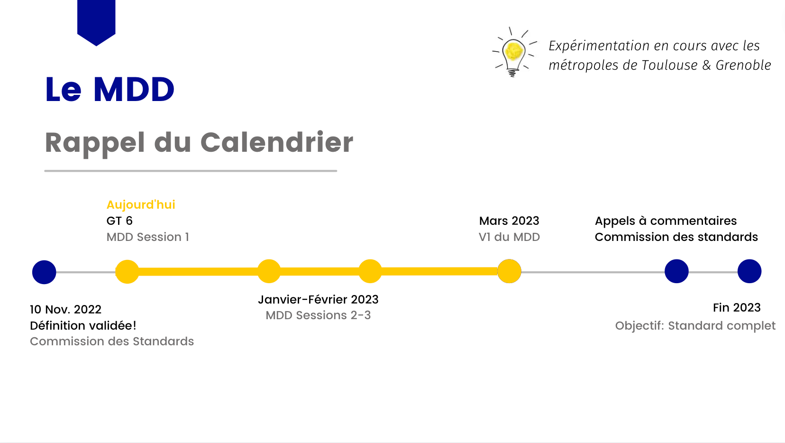
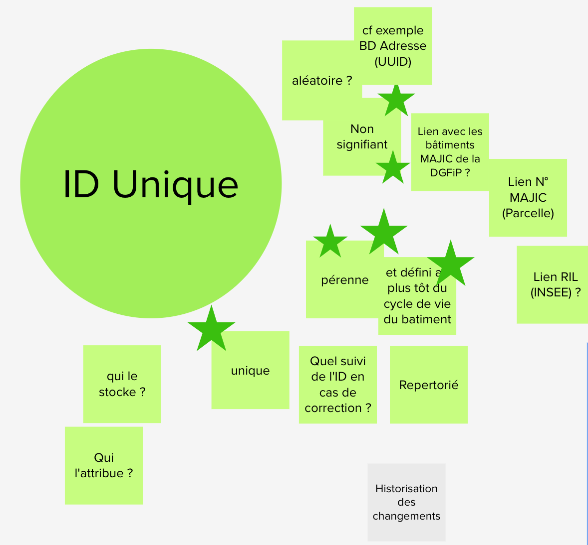
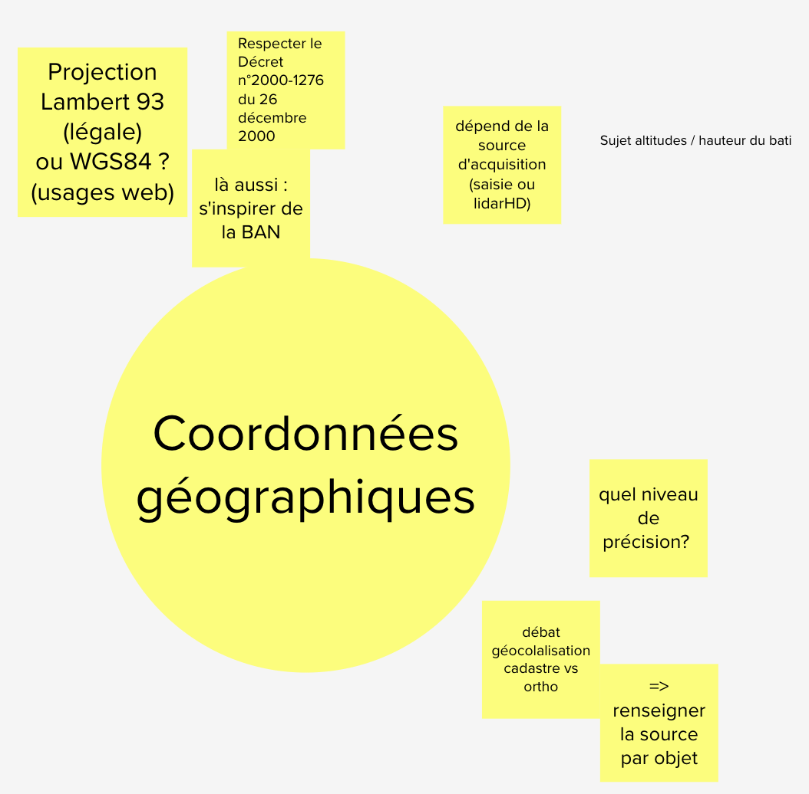
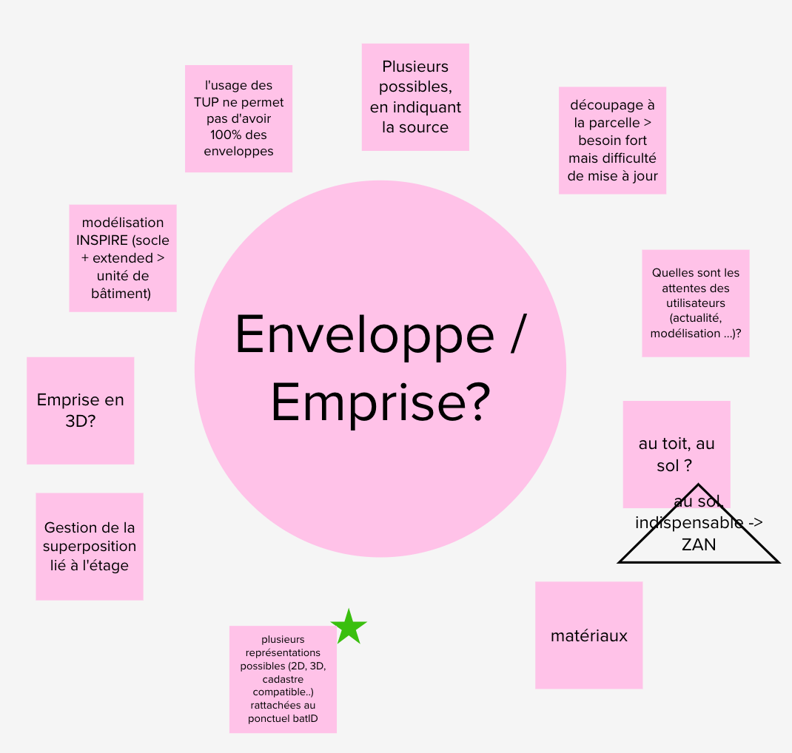
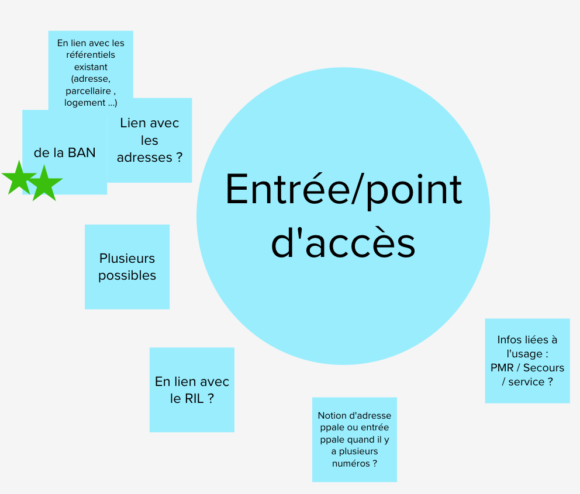
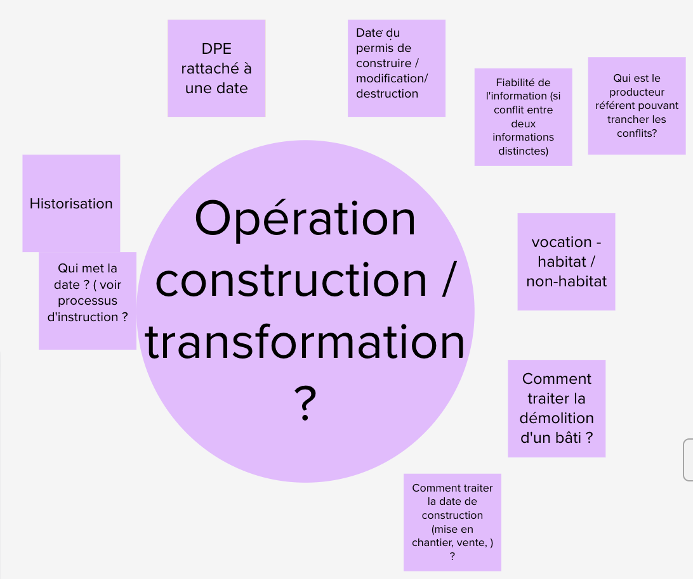
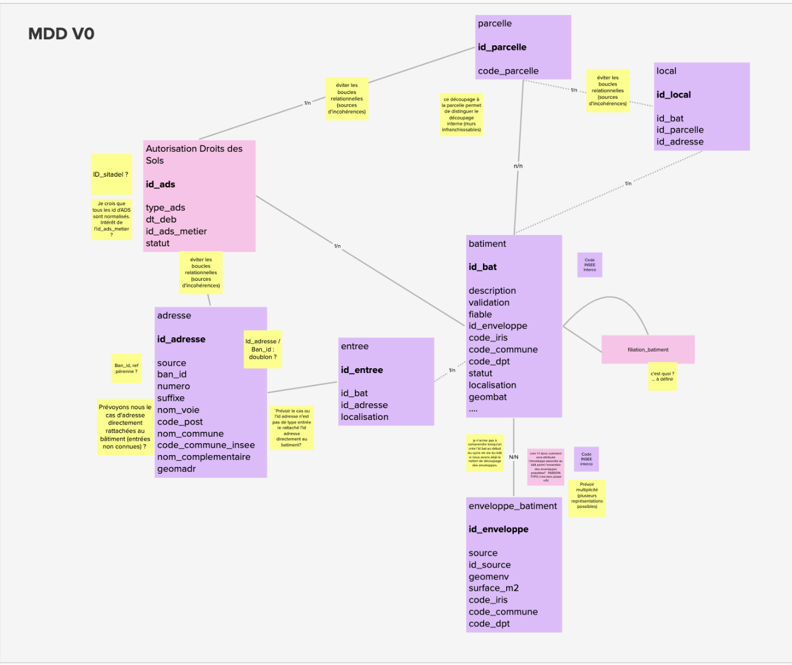

# Compte Rendu Groupe de Travail Bâti n°6

**Date:** 06.12.22

**Lien vers le replay:** <https://bbb-dinum-scalelite.visio.education.fr/presentation/f41d9500ea95d3742d11f47b674b12e18463aa84-1670338703535/meeting.mp4>

**27 Participants:**

Adeline Ferchaud - Bordeaux Métropole

Arnauld GALLAIS (Cerema)

Christine Bordier - DHUP/PH4

Colin GUIGNABAUDET (Métropole de Montpellier)

Cyril Chabert (Wegoto)

Dufresne Emilie AREC Occitanie

Elisabeth Talbourdet-Ville - BatID

Emmanuelle Martin EPT 12 Grand Orly Seine Bièvre

Félix V - BatID

Frederique Williams IGN

Georges Monnot - Toulouse Métropole

Guillaume Rateau

Isabelle Giraud DDTM34

Jean-Roc Morreale (Metropole Lille)

Julieta Barado - DGALN

MAITREPIERRE ANSC Administratrice de données SIG

Pierre Nguyen Trong (GRDF)

Pierre PAGES(Toulouse Métropole)

Sébastien Wehrlé (Eurométropole de Strasbourg)

Sonia PELLOUX

Stéphanie ALIBERT - Toulouse Métropole

Sylvain Bardin (Métropole Aix-Marseille-Provence)

Thierry Lallemant (IGN)

Vincent Gomand (DGFiP)

Vincent Masson (IGN)

Yélise Akol IGN

## Récapitulatif des évènements du mois de Novembre 2022

- Validation de la définition par la Commission des Standards le 11 novembre 2022
  - L’annexe quant à elle peut encore être sujet à évolution
- Le projet Bat-ID continu en 2023 au sein de la Fabrique des Géo-communs de l’IGN
  - Avec pour projet de faire des liens renforcés avec la BAN

## Phase 2 - Conception du Modèle de Données - Cadrage

### Planning prévisionnel

### Modes de travail

- Proposition de travail en asynchrone sur GitHub entre les différentes sessions de
  travail du GT
  - Validé par les membres du GT, sous réserve d’une animation forte pour une bonne participation
- Quelle compétence sera mobilisée dans la rédaction du standard ? IGN conseil ?
  - IGN normalisation
  - Point d’action Bat-ID
- Quel rythme de travail ?
  - Si on objective un standard complet en fin 2023, il faut que le GT soit d’accord sur le standard en Sept. 2023
  - Sondage : 12 participants souhaitent une réunion tous les 2 mois, 8 participants souhaitent une réunion tous les mois
    - A compléter avec le travail en asynchrone
    - A compléter avec le résultat des expérimentations menées à Grenoble & Toulouse
  - Possibilité d’avoir des réunions plénières et des ateliers intermédiaires sur des points spécifiques.

## Echanges sur la conception du modèle de données

### Études des concepts autour de l’objet “Bâtiment”

#### 1. Sur la notion d’ID Unique

- Sur l’aspect “unique”

  - ID unique : incontournable

- Sur l’aspect “pérenne”

- Sur l’aspect “signifiant”

  - Est ce qu’un ID doit inclure un code de parcelle / de commune ?
  - Le risque est sur la pérennité et la robustesse de l’ID, notamment en cas de fusion de commune
  - Les différents participants en majorité souhaitent prendre l’approche d’un ID **non signifiant.**
  - Commentaire sur CR : En phase avec l'exigence forte d'Id non signifiant. Eviter les uuid, inutilisables au quotidien par des humains.

- Soulève la question de **qui** créé l’identifiant:

  - Proposition:
    - Gestion Centralisée, cela doit être un identifiant unique et aléatoire
    - Le responsable du RNB offre un service de génération des identifiants uniques au niveau central
  - Proposition alternative évoquée : La compétence revient au niveau de la commune. Si c’est au niveau d’une compétence communale, il pourrait y avoir le n° INSEE de la commune pour que la commune puisse générer ces identifiants. L’identifiant pourrait ainsi permettre de regrouper par communes.
    - Commentaire sur CR : Le code insee n'est pas stable dans le temps, Pas question de recodifier les milliers de batiments d'une commune en cas de fusion / division

- Sur l’exemple des BAL de la BAN

  - Clé d’interopérabilité, chaque opérateur de données peut la calculer, et elle a été mise en place **le temps d’avoir un ID unique d’adresse non signifiant**.

#### 2. Sur la notion de coordonnées géographiques

- Normes d’expression des coordonnées géographiques : légal (Lambert 93 en métropole ) vs usages (appli web généralement en WGS 84).
  - Les deux systèmes de coordonnées sont utilisés dans les BALs et la BAN
  - Le lambert 93 n'est pas obligatoire, c'est le RGF93 qui l'est. C'est un système de coordonnées non projeté compatible avec le WGS84.  Donc pour moi, stockage métropole en RGF93 , diffusion en lambert / RGF / WGS84. Si on utilise des outils de diffusion standard en webservice (OGCAPIF / WFS) c'est l'utilisateur final qui choisi sa projection en fait.
  - Commentaire sur CR : La question reste en revanche totale pour les DOM TOM qui ont chacun un sphéroide de référence. On ne coupera pas à un stockage par DOM/TOM spécifique. Si on bascule en WGS84 pour simplifier ça, on descend à une résolution spatiale au mieux de **2m** , ce qui n'est plus acceptable avec les exigences de localisation actuelles.
  
- Quel niveau de précision ? Proposition : A minima, coordonnées géographiques assurées d’être à l’intérieur des enveloppes constituant le bâtiment.
  - Commentaire sur CR : Attention, c'est de la qualité sémantique de préciser que le ponctuel doit être dans l'enveloppe, pas de la précision ou de la résolution spatiale. (super important d'être clair sur les termes de métrologie et qualité). En résolution spatiale, ce sera celle de la source de données utilisée pour localiser l'objet. Orthophoto, levé GPS, calage sur du LIDAR, contour bd parcellaire, contour MAJIC etc.. via la généalogie au moment de la création du point. L'appli finale devra permettre de qualifier ça. Et on doit au moins spécifier une exigence de précision compatible RGE, ie < 1m.

#### 3. Sur la notion d’enveloppe / emprise

- ID unique et coordonnées géographique : permet de se rattacher à plusieurs emprises/géométries si besoin.
- Avec un ponctuel, on peut faire coexister la vision cadastre et ortho (bien que celles- ci possèdent un décalage), on évite alors le débat de la représentation géométrique.
  - Commentaire CR : malheureusement non. Le positionnement d'un point sur ortho ou levé GPS levera bien le débat. Mais les positionnements relatifs vis à vis d'autres référentiels non. On vivra avec, la généalogie de qualité de positionnement est essentielle pour la suite.

- L’origine de chaque enveloppe devra être diffusée
- question : le référentiel doit-il juste faire référence à l’ID et la source de l’enveloppe où également contenir certaines (lesquelles) enveloppes géométriques ?
  - Compromis à trouver pour faciliter l’usage/ l’adoption du référentiel.
  - Prochaine session : prendre un temps pour évoquer quelques cas d’usages afin que chacun puisse comprendre les problématiques des uns et autres.

#### 4. Sur la notion d’entrée / point d’accès

- Notion de point d’accès ‘entrée principale’ → notion reliée à l’usage → Conclusion, avoir a minima un point d’entrée, mais pas nécessairement utile d’introduire le concept d’entrée principale (les Suisses ne le font pas). La notion principale émerge selon les usages.
- En lien avec le RIL ? Si possible, serait super intéressant de mettre en place ces synergies
- Les participants soulignent l'importance de faire le lien avec la BAN.

#### 5. Sur la notion d’opération de construction / transformation

- Lier le référentiel du bâtiment à ces concepts permet une historisation accessible.
- Eléments clefs de la vie d’un bâtiment.
- Est ce que l’on souhaite avoir l’ID du bâtiment rattachés au DPE? Oui, sujet en discussion à l’ADEME, pour intégrer l’ID du bâtiment et des locaux.
  - Commentaire sur CR : Ce sera variant par lot de données. Pour moi tout le référentiel doit être accompagné d'un outil de remontées d'anomalies ou propositions d'enrichissement avec workflow de validation. La validation sera remontée aux différents producteurs d'attributs. On prototype ça sur la BDNB et la demande utilisateur est ENORME. d'autant plus vues les erreurs existantes. Si on a ça, c'est une piste de rattrapage de l'historique énorme. Le facteur limitant sera la ressource disponible pour encaisser ce flux de remontées.

- Fiabilité de l’information ? Question plus générique que les opérations de construction transformation.
  - Droits de modification et création de la donnée à mettre en œuvre, contribution ouverte avec historique? Preneur d'idées → sujet de réflexion et proposition à venir.
  - Importance de la notion de la certification (permettre la création et certains usages/acteurs certifiant)
  - Importance de la qualité de l'agrégation de données si différentes sources.

- Données d’historisation attendue : définir les critères sur lesquels on souhaite apporter une qualification.
- Bien introduire le concept de filiation : historisation des modifications, et permettre les liens au gré des évolutions du bâtiment.
- Comment traiter la date de construction ? de la mise en vente ?
  - qu’est ce qu’on souhaite rattacher au bâtiment (directement table bâtiment, qu’est ce qu’on rattache à d’autres concepts)
  - A partir de quand un bâtiment est “vraiment” un bâtiment ? A partir du moment où il est capable d’abriter des humains (au regard de la définition)
  - Commentaire sur CR : la date de mise en vente ne me parait pas être du ressort du référentiel. Par ailleurs on ne vends pas des batiments, mais des lots. Les notaires et impots sont là pour ça.

**Résumé par un participant** : Un bâtiment, défini comme (cf. définition) est identifié de façon unique et pérenne par un ID non signifiant de type UUID. Il est positionné ponctuellement dans l'espace, en projection légale Lambert 93 et/ou en coordonnées géographiques WSG84. Il dispose de plusieurs accès (en relation avec la BAN) et d'une ou plusieurs emprises en 2D et /ou 3D issues d'autres bases de données (ex : BDTopo), dont l'origine est renseignée. La vie du bâtiment (construction, fusion, séparation, démolition, etc.) est historisée.

- Commentaire sur CR: gros -1 sur l'UUID (j'ai essayé, c'est élégant, mais ça bloque l'appropriation au quotidien). Une bonne vieille sequence est mémorisable sur un post it, transmissible au téléphone. Un UUID ne se transmet qu'avec un copier - coller.

### Echange autour d’un modèle V0 du modèle de donnée

**Remarque générale:** certaines relations vont constituer des boucles et pourraient amener à des incohérences (créer une relation direct peut potentiellement créer une incohérence avec autre relation) → peut être plutôt partir sur un schéma en étoile (surtout que pour le reste, peut être que ça ne correspondra pas aux cas d’usages)

#### Table ADS (Autorisation Droits des Sols)

- Si les ID des ADS sont déjà normalisés et donc unique, inutile d’avoir un ID ADS spécifique à la base et un champ métier, autant utiliser ces derniers ?

  - **Attention**, peut être pas normalisé (différence selon les éditeurs de logiciels)

  - Seule normalisation existante, extract SITADEL (mais quelques mois de décalage d’ici la réédition)

- Bien distinguer : dématérialisation des documents d’urbanisme vs. dématérialisation des procédures (via logiciel etc...)

- Est ce qu’on ajoute l’ID SITADEL? Pourquoi pas (sera nécessairement facultatif car SITADEL contient une partie des constructions mais pas toutes).
  - commentaire sur CR : +1, un mécanique générique de stockage d'ID de référentiels externes serait une bonne idée dans l'implémentation. Dans le modèle de données, on peut rester spécifique.

#### Table Adresses

- ID adresse / ID BAN → Doublons ?
  - Quid des adresses qui ne sont pas encore dans la BAN ? → A terme, uniquement un ID BAN.
    - Commentaire sur CR : Il y a un peu de politique là dedans. Mais pour moi l'adresse BAN doit être obligatoire, et on doit pouvoir en plus stocker des adresses alternatives (ARCEP / RIL etc) pour assurer la transition des contenus progressivement.
  - ID BAN permette le pivot entre les référentiels
  - Dans un premier temps, l’ID adresse va être uniquement créé là où il y a des BALs
- Quid des adresses directement rattachées au bâtiment si point d’entrée non connu ? adresse souvent localisées au bâtiment → donc directement rattachée au bâtiment → par défaut, peut être mettre un ID entrée (mais pas encore avoir de localisant) → permettrait de le préciser par la suite.
  - **Ce point reste à creuser**

#### Table Enveloppe

- Découpage au parcellaire ? Via la BD Topo le thème bâti est découpé par les parcelles car seul moyen de découper les murs infranchissables.

  - Commentaire sur CR : c'est là que le vrai dilemne commence. Une métropole qui a une acquisition d'emprise au sol par topographie, levé lidar ultra précis d'un immeuble en bordure de parcelle sera forcément incohérence avec la BDTOPO, le parcellaire etc.. Je serais d'avis de permettre de pousser la géométrie la plus précise, bien qualifiée, et de laisser l'IGN ajuster la topologie de ses référentiels dessus. Sinon on ne se crée un bridage collectif qui nous empêche ad vitam de progresser sur les contours. On a la RPCU qui redémarre, de toutes façons nos contours de référence actuels sont déjà faut. La cohérence topologique intéreférentiels n'est pas encore là.
    En revanche, ça me parait raisonnable dans le cas majoritaire d'une digitalisation sur fond de plan de faire l'accrochage sur la bd parcellaire.
  - Suite commentaire sur CR : La priorité d'accrochage devrait se faire :
    - sur un fond de plan haute résolution de topographe au géométre si disponible
    - sur les points de borne et limites du foncier unifié GeoFoncier
    - a défaut sur le parcellaire bd topo

    ça ne relève clairement pas du MVP ni de la V1, mais c'est faisable.

- Est ce que qu'avec le batID, on va identifier plusieurs ID bâtis à un bloc ?
  - On peut se dire que l’ID enveloppe a un impact sur l’identifiant bâtiment
  - **-  Ce point reste à creuser**

#### Table Filiation batiment

- Relation parent enfant → **À expliciter** : ex : deux bâtiments distincts, on décide lors de travaux de les réunir → filiation, les deux bâtiments en deviennent un seul, on souhaite historiser ces liens de transformation pour ne pas perdre l’historique.

- S'inspirer de ce qui se fait déjà :
  - la base de filiation de l’artificialisation des sols
  - idem pour les parcelles cadastrales
  - évolution des communes par l’INSEE
  - Proposition : mettre en place un référencement sur un tout petitterritoire afin d’itérer dessus en mode agile → permettant de valider/invalider hypothèse (ex: relation entre le bâtiment et son emprise) → Idée de le faire dans les cadres d'expérimentations avec les communes → donc trouver un moyen d’avoir des petits territoires (et faire des retour des différentes versions du modèle ) → permettra de donner à voir sur l’implémentation et son évolution.
